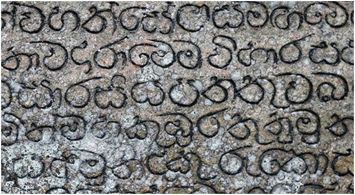
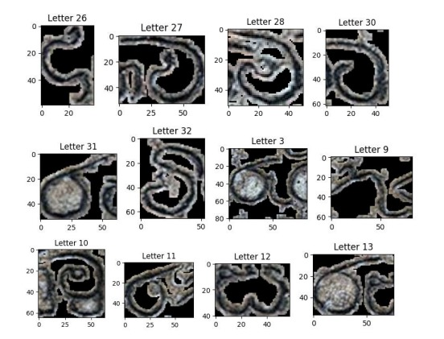

# rock-inscriptions-extraction-using-OpenCV-image-processing

This repository contains a Python script for extracting text from rock inscriptions in images. The script utilizes computer vision techniques to preprocess the image, detect contours, and extract individual letters from the inscriptions.

## Introduction

Rock inscriptions hold valuable historical and cultural information, but extracting text from images of these inscriptions can be challenging due to various factors such as erosion, lighting conditions, and background noise. This script aims to automate the process of extracting text from rock inscriptions using image processing techniques.

## Installation

To use this script, follow these steps:

1. Clone this repository to your local machine.
2. Install Python if you haven't already.
3. Install the required dependencies using pip:

```bash
pip install opencv-python numpy matplotlib
```

## Usage

1. Replace the image path in the script (`plate.jpg`) with the path to your rock inscription image.
2. Run the script.
3. Adjust parameters such as `min_contour_area` and cropping conditions (`if y >= 30 and x >= 30`) as needed to suit your specific image.

Sure, let's break down and explain each part of the code:

```python
import cv2
import numpy as np
import matplotlib.pyplot as plt
```

- This section imports necessary libraries:
  - `cv2`: OpenCV library for image processing.
  - `numpy`: Numerical computing library for handling arrays and matrices.
  - `matplotlib.pyplot`: Plotting library for visualizing images.

```python
# Load the image
image_path = 'plate.jpg'  # Change this to the path of your image
img = cv2.imread(image_path)
```

- This part loads the input image specified by `image_path` using OpenCV's `cv2.imread` function.

```python
# Convert the image to grayscale
gray = cv2.cvtColor(img, cv2.COLOR_BGR2GRAY)
```

- The image is converted to grayscale using `cv2.cvtColor` function. This is often a pre-processing step for many computer vision tasks as it simplifies subsequent operations.

```python
# Apply GaussianBlur to reduce noise and improve edge detection
blur = cv2.GaussianBlur(gray, (5, 5), 0)
```

- Gaussian blur is applied to the grayscale image using `cv2.GaussianBlur`. This helps in reducing noise and improving edge detection in the image.

```python
# Apply adaptive thresholding to create a binary image
thresh = cv2.adaptiveThreshold(blur, 255, cv2.ADAPTIVE_THRESH_MEAN_C, cv2.THRESH_BINARY_INV, 13, 7)
```

- Adaptive thresholding is applied to the blurred image using `cv2.adaptiveThreshold`. This method calculates thresholds for small regions of the image, which helps in handling varying lighting conditions.

```python
# Find contours in the binary image
contours, _ = cv2.findContours(thresh, cv2.RETR_EXTERNAL, cv2.CHAIN_APPROX_SIMPLE)
```

- Contours are detected in the binary image using `cv2.findContours`. Contours represent the boundaries of objects in an image.

```python
# Filter contours based on area (to remove small noise)
min_contour_area = 300
filtered_contours = [cnt for cnt in contours if cv2.contourArea(cnt) > min_contour_area]
```

- Contours with an area smaller than `min_contour_area` are filtered out to remove small noise or artifacts from the image.

```python
# Create a mask for contours
contour_mask = np.zeros_like(gray)
cv2.drawContours(contour_mask, filtered_contours, -1, (255), thickness=cv2.FILLED)
```

- A mask is created to highlight the contours using `cv2.drawContours`. This mask will be used to separate the text regions from the background.

```python
# Apply dilation to separate the lines
kernel = np.ones((5, 5), np.uint8)
dilated_mask = cv2.dilate(contour_mask, kernel, iterations=1)
```

- Dilation is applied to the contour mask using `cv2.dilate`. This helps in expanding the text regions to make sure they are properly segmented.

```python
# Draw the dilated mask on a blank image
dilated_img = np.zeros_like(img)
dilated_img[dilated_mask > 0] = img[dilated_mask > 0]
```

- The dilated mask is used to create a new image where only the text regions are retained. This step helps in visualizing the segmented text regions.

```python
# Crop and print each letter
for i, cnt in enumerate(filtered_contours):
    x, y, w, h = cv2.boundingRect(cnt)

    # Check conditions for cropping
    if y >= 30 and x >= 30:
        letter_crop = dilated_img[y:y + h, x:x + w]

        # Display each cropped letter
        plt.figure(figsize=(2, 2))
        plt.imshow(cv2.cvtColor(letter_crop, cv2.COLOR_BGR2RGB))
        plt.title(f'Letter {i+1}')
        plt.show()
```

- Each contour bounding box is identified using `cv2.boundingRect`. 
- Conditions are checked to ensure the bounding box coordinates meet the cropping requirements.
- Cropped letters are displayed using `matplotlib.pyplot.imshow`.## Example

##Example

sample image 



the resulting extracted text.



## Contributing

Contributions are welcome! Please feel free to submit bug reports, feature requests, or pull requests. For major changes, please open an issue first to discuss the proposed changes.

## License

This project is licensed under the MIT License - see the [LICENSE](LICENSE) file for details.

## Contact Information

For questions or inquiries, please contact blherath@gmail.com .

## Acknowledgments

OpenCV: https://opencv.org/

---

Feel free to modify and extend the README according to your specific requirements. If you encounter any issues or have suggestions for improvement, please open an issue or submit a pull request. Happy coding!
